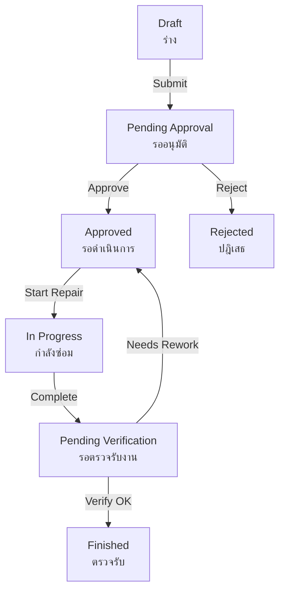

# Asset Repair Workflow Improvements - Design Document

## Overview
Align the ERPNext Asset Repair workflow with TUB's physical form (FM-EN-04 rev.00 ใบแจ้งซ่อม/ติดตั้งใหม่) and improve the repair request process.

---

## 1. Two Types of Repair Requests

### Current Problem
- Only maintenance inspectors can report issues during scheduled PM
- No way for non-technical staff to report broken equipment

### Proposed Solution: Two Repair Request Sources

#### Type A: **Production Staff Repair Request** (ผู้ใช้งานแจ้งซ่อม)
**Who:** Production workers, operators, anyone using the equipment
**Role Name:** `Asset User` (new role)
**Scenario:** Machine breaks during normal operation

**Flow:**
```
Asset User scans QR → Reports issue via /maintenance portal
→ Creates Asset Repair (source: "User Report")
→ Auto-assign to Maintenance Engineer
→ Engineer inspects the issue and fills assessment
→ Engineer submits to Manager for approval
→ Manager Approves/Rejects
→ (If Approved) Engineer performs repair
→ Asset User confirms completion
```

#### Type B: **Preventive Maintenance Discovered Issue** (ช่างพบปัญหาระหว่าง PM)
**Who:** Maintenance Inspector doing scheduled PM
**Scenario:** During routine inspection, discovers abnormality

**Flow:**
```
Inspector doing PM checklist → Discovers issue
→ Reports issue from checklist page
→ Creates Asset Repair (source: "PM Inspection")
→ Maintenance Manager assigns to engineer
→ Engineer repairs
→ Inspector confirms completion
```

### Implementation

#### 1.1 New Custom Field: `repair_source`
**Field Type:** Select
**Options:**
- User Report (ผู้ใช้งานแจ้งซ่อม)
- PM Inspection (พบระหว่าง PM)

#### 1.2 New Role: `Asset User`
**Permissions:**
- Read Asset
- Create Asset Repair (via /maintenance portal only)
- View own repair requests
- Confirm repair completion

#### 1.3 Maintenance Portal Changes

**New Page:** `/maintenance/report-issue/{asset_name}`

**Form Fields:**
- Problem Description (required)
- Photo Upload (min 1 photo)
- Urgency (Low/Medium/High)
- Reporter Contact (auto-filled from user)

**Submission:**
- Creates Asset Repair with:
  - `repair_source = "User Report"`
  - `failure_date = now()`
  - `workflow_state = "Draft"`
  - `assign_to = Maintenance Manager` (auto-assigned)

---

## 2. Form Field Order Alignment with FM-EN-04

### Current ERPNext Asset Repair Form Order
```
1. Asset Name
2. Failure Date
3. Assign To
4. Repair Status
5. Description
6. Actions Performed
7. Repair Cost
8. Downtime (hours)
```

### TUB FM-EN-04 Form Order (ใบแจ้งซ่อม/ติดตั้งใหม่)

From the attached PDF, the form follows this structure:

```
Section 1: ข้อมูลเครื่องจักรและผู้แจ้งซ่อม (Asset Info & Reporter)
├─ ชื่อแผนก (Department)
├─ ห้อยเครื่องจักร (Asset Code/Name)
├─ รหัสของซิ่งยากรจุน/กลาส (Item Code)
├─ เลขที่เครื่องจักรที่ซ่อนและท  (Asset ID from QR/scan)
├─ รายละเอียด/สิ่งที่ดำเนินการ (Problem Description)
├─ ผู้แจ้งต้องติดมอนุติ  (Reporter Name + Date)
└─ ผู้รับแจ้ง (Receiver Name + Date)

Section 2: ลำดับขั้นตอนการดำเนิน (Repair Process Steps)
├─ การดำเนินการ (Action Type: ซ่อมเบต/ซ่างาทยบต/มิคำใช่งาย/ไม่ผิดส่าย)
├─ รายการ/อดตร้างของ้า (Parts/Materials List)
│   ├─ ลำดับ (Item No)
│   ├─ รายการ (Description)
│   ├─ ใบงซื้อมดบที่ (PO Number)
│   ├─ จำนวน (Quantity)
│   └─ หมายเหตุ (Remarks)
├─ รายการ/อะไภร้างใช้ (Tools/Equipment Used)
│   └─ Similar structure

Section 3: ผู้รับผิดชอบ (Responsible Parties)
├─ ผู้แจ้ง (Reporter Signature + Date)
├─ ผู้รับแจ้ง/แขดิแวตรวา (Receiver/Coordinator Signature + Date)
├─ ผู้ผีตการโครงการ (Engineer Signature + Date)
└─ ตรวจรับงาน (Inspector Verification)
    ├─ ผล (Result): เรียบร้อย / ไม่เรียบร้อย
    ├─ วันที่ซิมตซบถาน (Completion Date)
    └─ หายเหตุ (Remarks)

Section 4: สภาพการดำเนินการเมื่อชัวงาทเปลูกอบกั (Additional Info)
├─ เรียบร้อย/สะอาดใหม่เเดง่องการต่บเนือน (Clean/Organized: Yes/No)
├─ ไม่เรียบร้อย/ติ่งเชหะา (Not organized: Yes/No)
├─ ความสะอาดสารและเกี้อนเข้าบีนุหันถามต้าน (Cleanliness status)
└─ ความสะอิก้องานที่ติดส้แบบนีฮันงาน (Work area condition)

Section 5: Summary Box (หมายเหตุ + Signatures)
├─ หมายเหตุ (Additional remarks field)
├─ ตั้งสำทีดมเจิจ็องตรวดิมเงกาง (QC/Safety notes)
└─ ย่าปท ถ้มินออกแมเนว้อง (Signature line at bottom)
```

### Proposed ERPNext Field Order

Reorganize Asset Repair form sections to match TUB form:

**Section 1: Asset Information & Reporter** (ข้อมูลเครื่องจักรและผู้แจ้งซ่อม)
```python
[
    {"fieldname": "asset_name", "label": "ชื่อเครื่องจักร/Asset"},
    {"fieldname": "item_code", "label": "รหัสของซิ่งยากร", "fetch_from": "asset_name.item_code"},
    {"fieldname": "asset_location", "label": "สถานที่ตั้ง", "fetch_from": "asset_name.location"},
    {"fieldname": "column_break_1"},
    {"fieldname": "failure_date", "label": "วันที่แจ้งซ่อม"},
    {"fieldname": "repair_source", "label": "ประเภทการแจ้ง"},
    {"fieldname": "section_break_reporter"},
    {"fieldname": "reported_by", "label": "ผู้แจ้ง", "default": "user"},
    {"fieldname": "reported_date", "label": "วันที่แจ้ง", "default": "now"},
    {"fieldname": "column_break_2"},
    {"fieldname": "received_by", "label": "ผู้รับแจ้ง"},
    {"fieldname": "received_date", "label": "วันที่รับแจ้ง"}
]
```

**Section 2: Problem Description** (รายละเอียด/สิ่งที่ดำเนินการ)
```python
[
    {"fieldname": "section_break_problem"},
    {"fieldname": "error_description", "label": "รายละเอียดปัญหา"},
    {"fieldname": "issue_photos", "label": "รูปถ่ายปัญหา"},
    {"fieldname": "column_break_3"},
    {"fieldname": "issue_severity", "label": "ความรุนแรง"},
    {"fieldname": "priority", "label": "ความเร่งด่วน"}
]
```

**Section 3: Repair Actions** (การดำเนินการซ่อม)
```python
[
    {"fieldname": "section_break_repair"},
    {"fieldname": "repair_type", "label": "ประเภทการดำเนินการ"},
    # Options: ซ่อมเฉพาะที่ / ซ่างานยืดยต / มิคำใช่งาน / ไม่ผิดส่าย
    {"fieldname": "repair_status", "label": "สถานะการซ่อม"},
    {"fieldname": "actions_performed", "label": "การดำเนินการที่ทำ"},
    {"fieldname": "column_break_4"},
    {"fieldname": "completion_date", "label": "วันที่ซ่อมเสร็จ"},
    {"fieldname": "downtime", "label": "เวลาหยุดเครื่อง (ชม.)"}
]
```

**Section 4: Parts & Materials** (รายการ/อะไภร้่างของ้า)
```python
[
    {"fieldname": "section_break_parts"},
    {"fieldname": "stock_items", "label": "อะไภร้่างที่ใช้"},
    # Child Table: Stock Consumption
    # Columns: ลำดับ, รายการ, ใบงซื้อ, จำนวน, หมายเหตุ
]
```

**Section 5: Verification** (ตรวจรับงาน)
```python
[
    {"fieldname": "section_break_verification"},
    {"fieldname": "verification_status", "label": "ผลการตรวจรับ"},
    # Options: เรียบร้อย (OK), ไม่เรียบร้อย (Not OK)
    {"fieldname": "verification_date", "label": "วันที่ตรวจรับ"},
    {"fieldname": "verification_notes", "label": "หมายเหตุการตรวจรับ"},
    {"fieldname": "verified_by", "label": "ผู้ตรวจรับ"}
]
```

**Section 6: Signatures & Approval** (ลายเซ็น)
```python
[
    {"fieldname": "section_break_signatures"},
    {"fieldname": "engineer_signature", "label": "ลายเซ็นช่าง"},
    {"fieldname": "engineer_sign_date", "label": "วันที่"},
    {"fieldname": "column_break_5"},
    {"fieldname": "approval_notes", "label": "บันทึกผู้อนุมัติ"},
    {"fieldname": "approval_signature", "label": "ลายเซ็นผู้อนุมัติ"}
]
```

### Field Reordering Implementation
Use `insert_after` in custom field definitions to match FM-EN-04 order.

---

## 3. Workflow Status Alignment

### Current Workflow States
```
Draft → Pending Approval → Approved → Finished
                        → Rejected
```

### TUB Form Status Requirements

Based on FM-EN-04, the lifecycle should match:

| Thai Status | English | ERPNext Workflow State | DocStatus |
|-------------|---------|------------------------|-----------|
| ร่าง | Draft | Draft | 0 |
| แจ้งซ่อม | Reported | Pending Approval | 1 (Submitted) |
| รอดำเนินการ | Awaiting Action | Approved | 1 |
| กำลังซ่อม | In Progress | Approved (repair_status = "Under Repair") | 1 |
| ซ่อมเสร็จ | Repair Complete | Pending Verification | 1 |
| ตรวจรับงาน | Verified | Finished | 1 |
| ปฎิเสธ | Rejected | Rejected | 1 |

### New Workflow States Needed

**Add:** `Pending Verification` (รอตรวจรับงาน)
- Triggered when: Engineer marks repair complete
- Who can transition: Maintenance Manager or Original Reporter
- Next states: Finished (verified OK) or Approved (needs rework)

### Updated Workflow Transitions



---

## 4. Lock Editing After Repair Finished

### Current Problem
After repair is marked "Finished", all fields remain editable including:
- repair_status
- repair_type
- actions_performed
- completion_date

This violates audit trail requirements.

### Solution: Workflow State Permission Control

#### 4.1 Update Workflow States Configuration

**Finished State:**
```json
{
  "state": "Finished",
  "doc_status": "1",
  "allow_edit": "No One",  // CHANGE FROM "All"
  "update_field": "custom_approval_status",
  "update_value": "ตรวจรับงานแล้ว"
}
```

#### 4.2 Python Validation Override

In `asset_repair_override.py`:

```python
def validate_asset_repair(doc, method):
    """Prevent editing of finished repairs"""

    # Check if repair is finished
    if doc.workflow_state == "Finished":
        # Only allow specific fields to be edited by managers
        if not frappe.has_role("Maintenance Manager"):
            frappe.throw(
                _("Repair {0} is finished and cannot be edited. Contact Maintenance Manager if changes are needed.").format(doc.name),
                title=_("Edit Not Allowed")
            )

        # Even managers can only edit these fields
        allowed_fields = ["approval_notes", "approval_signature", "verification_notes"]

        if doc.has_value_changed():
            changed_fields = [f for f in doc.get_valid_columns() if doc.has_value_changed(f)]
            restricted_fields = [f for f in changed_fields if f not in allowed_fields]

            if restricted_fields:
                frappe.throw(
                    _("Cannot edit fields: {0} after repair is finished").format(", ".join(restricted_fields)),
                    title=_("Edit Not Allowed")
                )
```

#### 4.3 Frontend JavaScript Lock

In `asset_repair.js`:

```javascript
frappe.ui.form.on('Asset Repair', {
    refresh: function(frm) {
        if (frm.doc.workflow_state === 'Finished') {
            // Make all fields read-only except manager fields
            frm.fields.forEach(field => {
                if (!['approval_notes', 'approval_signature', 'verification_notes'].includes(field.df.fieldname)) {
                    frm.set_df_property(field.df.fieldname, 'read_only', 1);
                }
            });

            // Show alert
            frm.dashboard.add_comment(__('This repair is finished and locked for editing'), 'blue', true);
        }
    }
});
```

---

## 5. Verification Confirmation Display

### Current Problem
When reporter confirms repair completion, there's no visible indicator on the Asset Repair document showing:
- Who verified
- When verified
- Verification result (OK/Not OK)

### Solution: Add Verification Section

#### 5.1 New Custom Fields

```python
{
    "fieldname": "section_break_verification",
    "fieldtype": "Section Break",
    "label": "Verification (ตรวจรับงาน)",
    "insert_after": "actions_performed"
},
{
    "fieldname": "verification_status",
    "fieldtype": "Select",
    "label": "Verification Result (ผลการตรวจรับ)",
    "options": "\nOK (เรียบร้อย)\nNot OK (ไม่เรียบร้อย)\nNeeds Rework (ต้องแก้ไข)",
    "depends_on": "eval:doc.workflow_state=='Pending Verification' || doc.workflow_state=='Finished'",
    "read_only_depends_on": "eval:doc.workflow_state=='Finished'"
},
{
    "fieldname": "column_break_verification",
    "fieldtype": "Column Break"
},
{
    "fieldname": "verified_by",
    "fieldtype": "Link",
    "label": "Verified By (ผู้ตรวจรับ)",
    "options": "User",
    "read_only": 1
},
{
    "fieldname": "verification_date",
    "fieldtype": "Datetime",
    "label": "Verification Date (วันที่ตรวจรับ)",
    "read_only": 1
},
{
    "fieldname": "verification_notes",
    "fieldtype": "Small Text",
    "label": "Verification Notes (หมายเหตุการตรวจรับ)"
}
```

#### 5.2 Auto-Fill Verification on Workflow Transition

In `asset_repair_override.py`:

```python
def on_update_after_submit_asset_repair(doc, method):
    """Auto-fill verification fields when transitioning to Finished"""

    # Detect Pending Verification → Finished transition
    old_workflow = getattr(doc, '_old_workflow_state', None)
    new_workflow = doc.get("workflow_state")

    if old_workflow == "Pending Verification" and new_workflow == "Finished":
        # Auto-fill verification fields
        if not doc.verified_by:
            doc.db_set("verified_by", frappe.session.user, update_modified=False)

        if not doc.verification_date:
            doc.db_set("verification_date", now(), update_modified=False)

        # If verification_status not set, default to OK
        if not doc.verification_status:
            doc.db_set("verification_status", "OK (เรียบร้อย)", update_modified=False)

        frappe.msgprint(
            _("Repair verified successfully by {0}").format(frappe.get_value("User", doc.verified_by, "full_name")),
            indicator="green",
            title=_("Verification Recorded")
        )
```

#### 5.3 Display Verification Badge in List View

Update list view to show verification indicator:

```javascript
// In asset_repair_list.js
frappe.listview_settings['Asset Repair'] = {
    add_fields: ["workflow_state", "verification_status", "verified_by"],

    get_indicator: function(doc) {
        if (doc.workflow_state === "Finished" && doc.verification_status === "OK (เรียบร้อย)") {
            return [__("Verified OK"), "green", "workflow_state,=,Finished"];
        } else if (doc.workflow_state === "Finished" && doc.verification_status === "Not OK (ไม่เรียบร้อย)") {
            return [__("Verified - Issues"), "orange", "workflow_state,=,Finished"];
        } else if (doc.workflow_state === "Pending Verification") {
            return [__("Awaiting Verification"), "blue", "workflow_state,=,Pending Verification"];
        }
        // Default indicators...
    },

    formatters: {
        verified_by: function(value) {
            if (value) {
                return `<span class="indicator green">✓ ${value}</span>`;
            }
            return "";
        }
    }
};
```

---

## 6. Maintenance Portal Changes

### 6.1 New "Report Issue" Button

On Asset Overview page (`/maintenance/asset/{asset_name}`):

```jsx
// Add button visible to Asset User role
{frappe.has_role("Asset User") && (
  <button className="btn-report-issue" onClick={() => navigate(`/report-issue/${assetName}`)}>
    🚨 REPORT ISSUE (แจ้งซ่อม)
  </button>
)}
```

### 6.2 Issue Reporting Form

**Route:** `/maintenance/report-issue/{asset_name}`

**Fields:**
- Asset Name (read-only, from QR scan)
- Problem Description (ประเภทปัญหา) - required, min 20 characters
- Photo Upload (รูปถ่าย) - required, min 1 photo
- Urgency (ความเร่งด่วน) - Low/Medium/High
- Contact Number (เบอร์ติดต่อ) - optional

**Submission API:**

```python
@frappe.whitelist()
def create_user_repair_request(asset_name, problem_description, photos, urgency, contact):
    """Create Asset Repair from Asset User report"""

    # Validate user has Asset User role
    if not frappe.has_role("Asset User"):
        frappe.throw(_("Only Asset Users can report issues"))

    # Create Asset Repair
    repair = frappe.get_doc({
        "doctype": "Asset Repair",
        "asset_name": asset_name,
        "failure_date": now(),
        "error_description": problem_description,
        "repair_source": "User Report",
        "reported_by": frappe.session.user,
        "reported_date": now(),
        "issue_severity": urgency,
        "custom_reporter_contact": contact,
        "assign_to": get_maintenance_manager(),  # Auto-assign to manager
        "workflow_state": "Draft"
    })

    # Attach photos
    for photo_base64 in photos:
        file_doc = frappe.get_doc({
            "doctype": "File",
            "file_name": f"issue_photo_{frappe.generate_hash()}",
            "attached_to_doctype": "Asset Repair",
            "attached_to_name": repair.name,
            "content": photo_base64,
            "is_private": 1
        })
        file_doc.insert()

    repair.insert()
    repair.submit()  # Auto-submit to trigger workflow

    return {
        "repair_id": repair.name,
        "message": _("Repair request submitted successfully")
    }
```

### 6.3 Inspector PM Discovery Flow

When inspector reports issue during PM checklist:

**From:** `/maintenance/checklist/{asset_name}`

**Add Button:** "Report Repair Issue" (แจ้งซ่อม)

**Pre-fills:**
- asset_name (from checklist)
- repair_source = "PM Inspection"
- reported_by = current inspector
- error_description = from checklist notes
- issue_photos = photos from checklist

---

## 7. Role Name Suggestion

For non-technical staff who can report issues:

### Option 1: `Asset User` ✅ RECOMMENDED
**Pros:**
- Clear and descriptive
- Matches ERPNext terminology
- Easy to understand

**Cons:**
- Generic

### Option 2: `Production Staff`
**Pros:**
- Specific to manufacturing context

**Cons:**
- Might exclude other departments (office, warehouse)

### Option 3: `Equipment Reporter`
**Pros:**
- Describes the action

**Cons:**
- Less clear about scope

**RECOMMENDATION:** Use `Asset User` role.

---

## 8. Implementation Priority

### Phase 1: Critical Fixes (Week 1)
1. ✅ Lock editing after Finished state
2. ✅ Add verification fields and display
3. ✅ Add `Pending Verification` workflow state
4. ✅ Update workflow transitions

### Phase 2: Form Alignment (Week 2)
1. Reorder fields to match FM-EN-04
2. Add missing fields (received_by, verification_status, etc.)
3. Update print format to match physical form
4. Test workflow end-to-end

### Phase 3: Portal Changes (Week 3)
1. Create Asset User role
2. Implement report-issue page
3. Add repair_source field
4. Update PM checklist integration

### Phase 4: Testing & Documentation (Week 4)
1. User acceptance testing with production staff
2. Update Thai user manuals
3. Training materials
4. Deploy to production

---

## 9. Database Migration Plan

### New Fields to Add
```python
custom_fields = [
    # Repair source tracking
    {
        "fieldname": "repair_source",
        "fieldtype": "Select",
        "options": "\nUser Report (ผู้ใช้งานแจ้งซ่อม)\nPM Inspection (พบระหว่าง PM)",
        "insert_after": "failure_date"
    },

    # Reporter info
    {
        "fieldname": "reported_by",
        "fieldtype": "Link",
        "options": "User",
        "insert_after": "repair_source"
    },
    {
        "fieldname": "reported_date",
        "fieldtype": "Datetime",
        "insert_after": "reported_by"
    },

    # Receiver info
    {
        "fieldname": "received_by",
        "fieldtype": "Link",
        "options": "User",
        "insert_after": "reported_date"
    },
    {
        "fieldname": "received_date",
        "fieldtype": "Datetime",
        "insert_after": "received_by"
    },

    # Verification fields
    {
        "fieldname": "verification_status",
        "fieldtype": "Select",
        "options": "\nOK (เรียบร้อย)\nNot OK (ไม่เรียบร้อย)\nNeeds Rework (ต้องแก้ไข)",
        "insert_after": "actions_performed"
    },
    {
        "fieldname": "verified_by",
        "fieldtype": "Link",
        "options": "User",
        "insert_after": "verification_status"
    },
    {
        "fieldname": "verification_date",
        "fieldtype": "Datetime",
        "insert_after": "verified_by"
    },
    {
        "fieldname": "verification_notes",
        "fieldtype": "Small Text",
        "insert_after": "verification_date"
    }
]
```

### Workflow Updates
```python
# Add new workflow state
new_state = {
    "doctype": "Workflow State",
    "name": "Pending Verification",
    "workflow_state_name": "Pending Verification",
    "icon": "eye",
    "style": "Info"
}

# Update Repair Approval WorkFlow
workflow_updates = {
    "states": [
        # Add Pending Verification state
        {
            "state": "Pending Verification",
            "doc_status": "1",
            "allow_edit": "Maintenance Manager",
            "update_field": "custom_approval_status",
            "update_value": "รอตรวจรับงาน"
        },
        # Update Finished state
        {
            "state": "Finished",
            "doc_status": "1",
            "allow_edit": "No One",  # CHANGE
            "update_field": "custom_approval_status",
            "update_value": "ตรวจรับงานแล้ว"
        }
    ],
    "transitions": [
        # Add transition from Approved to Pending Verification
        {
            "state": "Approved",
            "action": "Complete Repair",
            "next_state": "Pending Verification",
            "allowed": "Maintenance Engineer"
        },
        # Add transition from Pending Verification to Finished
        {
            "state": "Pending Verification",
            "action": "Verify OK",
            "next_state": "Finished",
            "allowed": "Maintenance Manager"
        },
        # Add transition from Pending Verification back to Approved (rework)
        {
            "state": "Pending Verification",
            "action": "Needs Rework",
            "next_state": "Approved",
            "allowed": "Maintenance Manager"
        }
    ]
}
```

---

## 10. Success Criteria

### Functional Requirements
- ✅ Asset Users can report issues via QR scan
- ✅ Inspectors can report PM-discovered issues
- ✅ Repair records are locked after completion
- ✅ Verification is tracked and visible
- ✅ Form order matches TUB physical form
- ✅ Workflow states align with Thai labels

### User Experience
- Average time to report issue: < 2 minutes
- 100% of repairs have verification recorded
- Zero unauthorized edits to finished repairs
- Form fields match printed FM-EN-04 order

### Compliance
- Audit trail intact (no edit after finish)
- All repairs traceable to source
- Verification confirmation documented

---

## 11. Open Questions

1. **Reporter notification:** Should Asset User receive notification when repair starts/finishes?
2. **Rework limit:** Maximum times a repair can be sent back for rework?
3. **Verification timeout:** Auto-verify if no response within X days?
4. **Photo requirements:** Minimum/maximum photos for different severity levels?
5. **Contact method:** SMS/Line notification for Asset Users?

---

**Ready to implement?** This comprehensive plan covers all requested changes:
- ✅ Two repair request types
- ✅ Form field order alignment
- ✅ Workflow status matching
- ✅ Edit locking after finish
- ✅ Verification display

---

## UPDATES (Based on User Feedback - January 2026)

### 1. CORRECTED WORKFLOW

**Updated Flow:**
```
Asset User scans QR
→ Reports issue via /maintenance portal
→ Creates Asset Repair (source: "User Report")
→ Auto-assign to Maintenance Engineer
→ Engineer inspects issue and fills assessment
→ Engineer submits to Manager for approval
→ Manager Approves/Rejects
→ (If Approved) Engineer performs repair
→ Asset User confirms completion
→ Status: Finished
```

### 2. COMPLETE FM-EN-04 STRUCTURE (All 5 Sections + Section 0)

**Section 0: Document Header** (NEW - ส่วนหัวเอกสาร)
- Repair Type: ซ่อม / แก้ไข / ติดตั้งใหม่ / ปรับปรุง
- Date (วันที่)
- Repair ID (เลขที่ใบแจ้ง)

**Section 1: Asset Info & Reporter** (ข้อมูลเครื่องจักรและผู้แจ้งซ่อม)
- ชื่อแผนก (Department)
- ชื่อเครื่องจักร/อุปกรณ์ (Asset Name)
- รหัสเครื่องจักร/อุปกรณ์ (Item Code)
- เลขที่เครื่องจักร (Asset ID)
- รายละเอียด/สิ่งที่ดำเนินการ (Problem Description)
- ต้นสังกัดผู้แจ้งอนุมัติ (Reporter's Head Approval + Date)
- ผู้อนุมัติ (Manager Approval + Date)

**Section 2: For Engineering Department** (สำหรับฝ่ายวิศวกรรม)
- การดำเนินการ (Action Type): ช่างภายใน/ช่างภายนอก/มีค่าใช้จ่าย/ไม่มีค่าใช้จ่าย
- รายการ/สิ่งที่ต้องทำ (Todo List) + การแก้ไข/การดำเนินงาน (Procedure) + ผู้ดำเนินงาน (Responsible)
- รายการอะไหล่ที่ใช้ (Spare Parts Used):
  - ลำดับ (Item No)
  - รายการ (Description)
  - ใบขอซื้อ/เลขที่ (PO Number)
  - จำนวน (Quantity)
  - หมายเหตุ (Remarks)
- ระยะเวลาดำเนินการ (Expected Duration) + วันที่เริ่มต้น + วันที่สิ้นสุด

**Section 3: Post-Repair Verification** (ตรวจสอบหลังการซ่อม)
- ผู้ประเมิน (Evaluator Signature + Date)
- ผู้ควบคุมตรวจสอบ (Head of Engineering Signature + Date)
- ผู้อนุมัติ (Manager Signature + Date)
- ตรวจรับงาน (Inspector Verification):
  - ผลการดำเนินการ (Result): เรียบร้อย / ไม่เรียบร้อย / อื่นๆ
  - วันที่ส่งมอบงาน (Completion Handover Date)

**Section 4: Hygiene & Safety** (บันทึกสุขลักษณะ/ความปลอดภัย)
- สถานะ: เรียบร้อย/สะอาดไม่เสี่ยงต่อการปนเปื้อน OR ไม่เรียบร้อย/ต้องแก้ไข
- ความสะอาดเครื่องจักรก่อนซ่อม (สะอาด/ไม่สะอาด)
- ความสะอาดเครื่องจักรหลังซ่อม (สะอาด/ไม่สะอาด)
- ความสะอาดสถานที่ก่อนซ่อม (สะอาด/ไม่สะอาด)
- ความสะอาดสถานที่หลังซ่อม (สะอาด/ไม่สะอาด)
- อุปกรณ์ที่นำเข้า (Parts Inserted List)
- อุปกรณ์ที่นำออก (Parts Removed List)

**Section 5: Final Remarks** (หมายเหตุ + Signatures)
- หมายเหตุเพิ่มเติม (Additional Remarks)
- ต้นสังกัดผู้แจ้งตรวจรับงาน (Reporter's Head Final Approval + Date)
- วันที่เริ่มใช้แบบฟอร์ม FM-EN-04 และผู้อนุมัติ (Form Usage Start Date + Approval Signature)

### 3. SPARE PARTS TRACKING

**New Child Table: Repair Spare Part**
Fields:
- item_no (ลำดับ)
- item_code (รหัสอะไหล่) - Link to Item
- item_name (รายการ) - Auto-fetched
- purchase_order (ใบขอซื้อ/เลขที่) - Link to Purchase Order
- qty (จำนวน) - Float
- uom (หน่วย) - Link to UOM
- warehouse (คลังสินค้า) - Link to Warehouse
- remarks (หมายเหตุ) - Small Text

**Auto Stock Entry Creation:**
- When repair is completed, auto-create Stock Entry (Material Issue)
- Links spare parts to inventory system
- Tracks consumption against Asset Repair

**Availability Check:**
- Before manager approves, check if spare parts are available
- Alert if stock is insufficient
- Link to Purchase Order if parts need ordering

### 4. MOBILE OPTIMIZATION

**Issues to Fix:**
- Text sizes inconsistent (too big/too small)
- Elements not aligned on mobile screens
- Touch targets too small
- Images not responsive

**Solution: Mobile-First CSS Framework**
```css
:root {
    --font-xs: 12px;
    --font-sm: 14px;
    --font-base: 16px;
    --font-lg: 18px;
    --font-xl: 20px;
    --font-2xl: 24px;
    --touch-target: 56px;
    --spacing-md: 16px;
    --border-radius: 8px;
}

body {
    font-size: var(--font-base);
    line-height: 1.5;
}

h1 { font-size: var(--font-2xl); }
h2 { font-size: var(--font-xl); }
h3 { font-size: var(--font-lg); }

button, .btn {
    min-height: var(--touch-target);
    padding: var(--spacing-md);
    font-size: var(--font-base);
}

.grid {
    display: grid;
    gap: var(--spacing-md);
    grid-template-columns: 1fr;
}

@media (min-width: 768px) {
    .grid { grid-template-columns: repeat(2, 1fr); }
}
```

Apply to all /maintenance portal pages for consistency.

### 5. UPDATED WORKFLOW STATES

```
Draft (ร่าง)
  → Pending Engineering Assessment (รอช่างตรวจสอบ) [NEW STATE]
    → Pending Manager Approval (รอผู้จัดการอนุมัติ)
      → Approved (อนุมัติ - กำลังซ่อม)
        → Pending Verification (รอตรวจรับงาน)
          → Finished (เสร็จสิ้น) [LOCKED - No Edit]
      → Rejected (ปฏิเสธ) [LOCKED - No Edit]
```

**Key Changes:**
- Added "Pending Engineering Assessment" state (Engineer fills assessment before manager sees it)
- Finished state: allow_edit = "No One" (completely locked)
- Auto-assign engineer when repair is created

### 6. CHILD DOCTYPES TO CREATE

1. **Engineering Todo Item**
   - task_no, task_description, status, completed_by

2. **Repair Spare Part**
   - item_no, item_code, item_name, purchase_order, qty, uom, warehouse, remarks

3. **Parts Inserted Item**
   - item_code, item_name, qty, serial_no

4. **Parts Removed Item**
   - item_code, item_name, qty, serial_no, disposal_method

### 7. IMPLEMENTATION PHASES (UPDATED)

**Phase 1 (Week 1): Critical Structure**
1. Add Section 0 (Repair Type header fields)
2. Add all missing fields from FM-EN-04 Sections 1-5
3. Create 4 child doctypes
4. Reorder fields to match form
5. Lock editing after Finished state

**Phase 2 (Week 2): Workflow & Integration**
6. Add "Pending Engineering Assessment" workflow state
7. Update workflow transitions
8. Implement spare parts Stock Entry auto-creation
9. Add spare parts availability check
10. Test approval flow end-to-end

**Phase 3 (Week 3): Mobile & Portal**
11. Apply mobile CSS framework to all portal pages
12. Fix text alignment and sizing issues
13. Test on iPhone SE, Samsung Galaxy
14. Update Report Issue page
15. Test QR scan → Report → Approve flow

**Phase 4 (Week 4): Testing & Deploy**
16. User acceptance testing
17. Update print format to match FM-EN-04 exactly
18. Update Thai documentation
19. Deploy to production VPS

---

**ALL CORRECTIONS APPLIED ✅**
- Workflow corrected (Engineer → Manager → Repair → User)
- Complete FM-EN-04 structure (Sections 0-5)
- Spare parts tracking designed
- Mobile optimization planned

**Next Step:** Review this updated design, then proceed with Phase 1 implementation.
